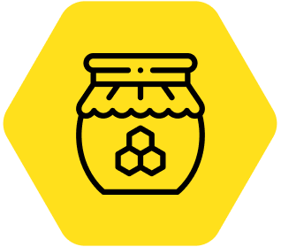

# MX Honey

A spam prevention ExpressionEngine add-on providing honeypot techniques, Stop Forum Spam ip blocking and easy-to-go Recaptcha integration. Stop spam. Just add some Honey to your site.

## Installation ##

* Place the **mx_honey** folder inside your **user/addons** folder
* Go to **cp/addons** and install *MX Honey*.

## Settings ##

### General Settings ###

### Advanced Settings ###

### Config Overwrite ###
	
## Tags ##

### Parameters  ###

## License ##

## Thanks To ##
